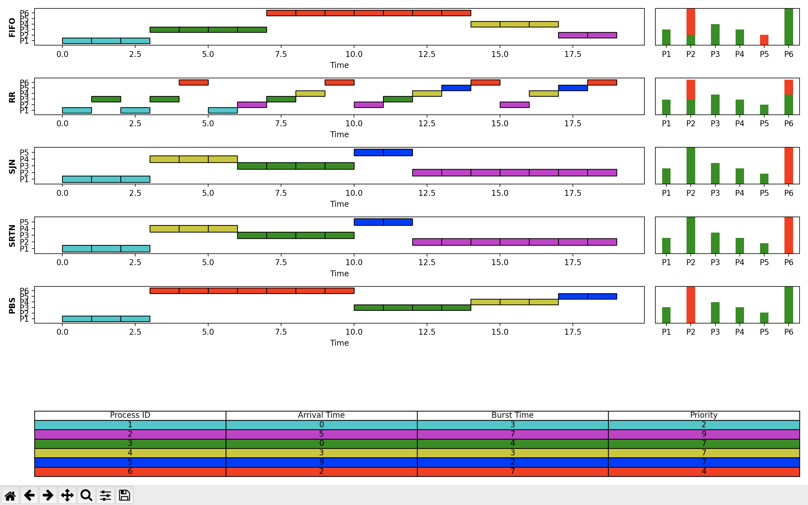

# CPU-Scheduling-Algorithm-Simulation



A python project that implements matplotlib to create a live visual of different scheduling algorithms for central processing units. 

To run:
```
git clone https://github.com/garrett-partenza-us/CPU-Scheduling-Algorithm-Simulation
cd CPU-Scheduling-Algorithm-Simulation
pip install -r requirements.txt
python run.py
```

##### First in First out (FIFO): Simplest scheduling algorithm that schedules according to arrival times of processes. First come first serve scheduling algorithm states that the process that requests the CPU first is allocated the CPU first. It is implemented by using the FIFO queue. When a process enters the ready queue, its PCB is linked onto the tail of the queue. When the CPU is free, it is allocated to the process at the head of the queue. The running process is then removed from the queue. FCFS is a non-preemptive scheduling algorithm.

##### Shortest Job Next (SJN): Process which have the shortest burst time are scheduled first.If two processes have the same bust time then FCFS is used to break the tie. It is a non-preemptive scheduling algorithm.

##### Shortest Remaining Time First (SRTN): It is preemptive mode of SJN algorithm in which jobs are schedule according to shortest remaining time.

##### Round Robin Scheduling: Each process is assigned a fixed time(Time Quantum/Time Slice) in cyclic way. It is designed especially for the time-sharing system. The ready queue is treated as a circular queue. The CPU scheduler goes around the ready queue, allocating the CPU to each process for a time interval of up to 1-time quantum. To implement Round Robin scheduling, we keep the ready queue as a FIFO queue of processes. New processes are added to the tail of the ready queue. The CPU scheduler picks the first process from the ready queue, sets a timer to interrupt after 1-time quantum, and dispatches the process. One of two things will then happen. The process may have a CPU burst of less than 1-time quantum. In this case, the process itself will release the CPU voluntarily. The scheduler will then proceed to the next process in the ready queue. Otherwise, if the CPU burst of the currently running process is longer than 1-time quantum, the timer will go off and will cause an interrupt to the operating system. A context switch will be executed, and the process will be put at the tail of the ready queue. The CPU scheduler will then select the next process in the ready queue.

##### Priority Based scheduling (Non-Preemptive): In this scheduling, processes are scheduled according to their priorities, i.e., highest priority process is scheduled first. If priorities of two processes match, then schedule according to arrival time. Here starvation of process is possible.
